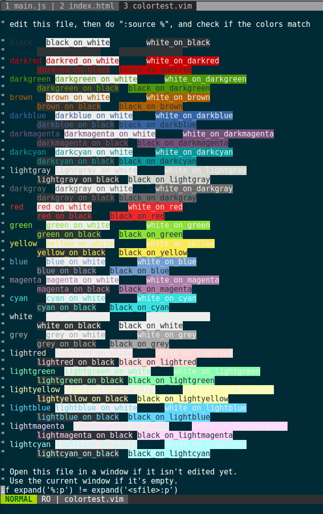

# Magnemite

Magnemite is heavily inspired by the Lucario flat theme.

> A colorful flat theme for [Vim](http://www.vim.org/), [Atom](https://atom.io/), [Sublime Text](http://www.sublimetext.com/3), [Xcode](https://developer.apple.com/xcode/), [Terminal.app](http://en.wikipedia.org/wiki/Terminal_%28OS_X%29), [XTerm](https://en.wikipedia.org/wiki/Xterm) and [iTerm](http://www.iterm2.com/).

## Getting Started

Add following line to your `~/.vimrc` file:

				syntax enable
				set number " comment this to hide numbering
				colorscheme magnemite

## Screenshots

